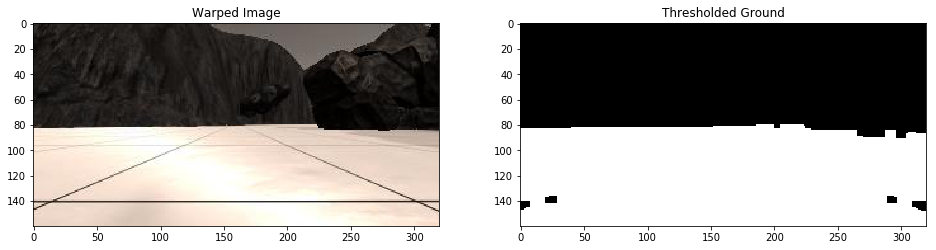
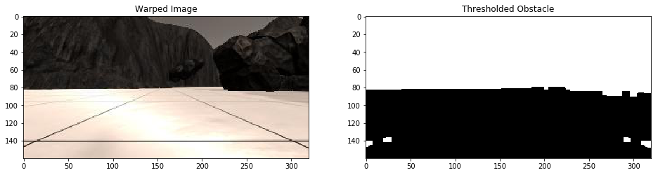
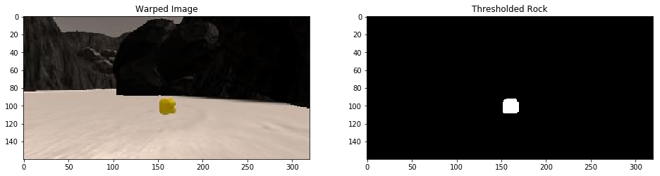

## README

### Technical Report for Computer Vision Based Search and Sample Return


---

**The goals of this project are the following:**  

**Calibration and Mapping**  

* Download the simulator and take data in "Training Mode"
* Implement functions to detect obstacles and samples of interest (golden rocks)
* Fill in the `process_frame()` function with the appropriate image processing steps (color threshold, perspective transform etc.) to get from raw images to a map.  The output frame you create in this step should demonstrate that your mapping pipeline works.
* Use `moviepy` to process the images in your saved dataset with the `process_frame()` function.  Include the video you produce as part of your submission.
* Test out the workflow in the Jupyter Notebook provided

**Autonomous Navigation**

* Fill in the `perception_step()` function within the `perception.py` script with the appropriate image processing functions to create a map and update `Rover()` data (similar to what you did with `process_image()` in the notebook).
* Fill in the `decision_step()` function within the `decision.py` script with conditional statements that take into consideration the outputs of the `perception_step()` in deciding how to issue throttle, brake and steering commands.
* Iterate on your perception and decision function until your rover does a reasonable (need to define metric) job of navigating and mapping.  

---

### Calibration and Mapping

#### 1. Describe and identify where in your code how you implement functions to identify obstacle and rock sample segmentation.

The code for obstacle and rock sample segmentation is contained in the notebook [Rover_Project_Test_Notebook.ipynb](code/Rover_Project_Test_Notebook.ipynb).

```python
# Single-channel thresholding:
def get_channel_mask(
    image,
    threshold
):
    """ Generate mask based on channel component values

    Args:
        image (numpy 2-d array): selected channel component of input image
        thresholds (2-element tuple): min & max values for thresholding

    Returns:
        generated mask
    """
    # Image dimensions:
    H, W = image.shape

    # Generate mask:
    mask = np.zeros((H, W), dtype=np.uint8)

    channel_min, channel_max = threshold

    mask[
        (channel_min <= image) & (image <= channel_max)
    ] = 1

    return mask

# Color thresholding:
def color_thresh(
    img,
    color_space,
    thresholds,
    morphology_kernel_size,
    morphology_iters = 0
):
    """ Generate mask based on color thresholding

    Args:
        img (numpy ndarray): input image
        thresholds (list of list of int): min & max values for each channel
    """
    if color_space == "RGB":
        conversion = cv2.COLOR_BGR2RGB
    else:
        conversion = cv2.COLOR_BGR2YUV

    # Set up morphological filtering:
    morphology_kernel = np.ones(
        (morphology_kernel_size,morphology_kernel_size),
        np.uint8
    )

    # Convert to HSV:
    converted = cv2.cvtColor(
        cv2.cvtColor(img, cv2.COLOR_RGB2BGR), conversion
    )

    # Get mask for each channel component:
    masks = [
        get_channel_mask(channel_component, threshold)
        for (channel_component, threshold) in zip(cv2.split(converted), thresholds)
    ]

    # Generate final mask:
    mask = masks[0] & masks[1] & masks[2]

    # Morphological filtering:
    if morphology_iters > 0:
        for _ in range(morphology_iters):
            mask = cv2.morphologyEx(
                mask,
                cv2.MORPH_CLOSE,
                morphology_kernel
            )
            mask = cv2.morphologyEx(
                mask,
                cv2.MORPH_OPEN,
                morphology_kernel
            )
    elif morphology_iters < 0:
        for _ in range(-morphology_iters):
            mask = cv2.morphologyEx(
                mask,
                cv2.MORPH_OPEN,
                morphology_kernel
            )
            mask = cv2.morphologyEx(
                mask,
                cv2.MORPH_CLOSE,
                morphology_kernel
            )

    return mask
```

The whole segmentation process goes as follows:

1. The image is converted to the specified color space
2. Objects of interest are segmented through color space filtering
3. The raw segmentation is further smoothed through combined morphological operations: first comes close with iteration 1, then comes open with iteration 2

Here is one sample output for ground & obstacle segmentation:





Here is another sample output for rock sample segmentation:



#### 2. Describe and identify in your code how you implemented the video frame processor and how you created a worldmap. Give the link to your sample video output for mapping.

The whole procedure is contained in the Jupyter notebook [Rover_Project_Test_Notebook.ipynb](code/Rover_Project_Test_Notebook.ipynb).

Below is the code snippet:

```python
# Static variable decorator:
def static_vars(**kwargs):
    def decorate(func):
        for k in kwargs:
            setattr(func, k, kwargs[k])
        return func
    return decorate

# Define a function to pass stored images to
# reading rover position and yaw angle from csv file
# This function will be used by moviepy to create an output video
# Frame processor:
@static_vars(
    bird_eye_view_painter = BirdEyeViewPainter([320, 160]),
    world_map_painter = WorldMapPainter(),
    world_map = data.ground_truth
)
def process_image(img):
    # Process scene image
    #

    # 0) Extract rover state:
    (x_trans, y_trans, yaw) = (
        data.xpos[data.count],
        data.ypos[data.count],
        data.yaw[data.count]
    )

    # 1) Apply color threshold to identify navigable terrain/obstacles/rock samples
    ground = color_thresh(
        img,
        "RGB", [[160, 255],[160, 255],[160, 255]],
        5, -1
    )
    obstacle = (ground == 0).astype(np.uint8)
    rock = color_thresh(
        img,
        "YUV", [[  0, 255],[128, 255],[ 20,  80]],
        7, 1
    )

    # 2) Apply perspective transform
    ground = perspect_transform(ground, source, destination)    
    obstacle = perspect_transform(obstacle, source, destination)
    rock = perspect_transform(rock, source, destination)

    # 4) Convert thresholded image pixel values to rover-centric coords & world coords
    coords = {
        "ground": {},
        "obstacle": {},
        "rock": {}    
    }
    for obj_name, obj_in_pixel in zip(
        ("ground", "obstacle", "rock"),
        (ground, obstacle, rock),
    ):
        # To rover centric:
        coords[obj_name]["rover"] = rover_coords(obj_in_pixel)
        coords[obj_name]["polar"] = to_polar_coords(*coords[obj_name]["rover"])
        # To world centric:
        coords[obj_name]["world"] = pix_to_world(
            coords[obj_name]["rover"][0], coords[obj_name]["rover"][1],
            x_trans, y_trans, yaw,
            world_size = 200,
            scale = 10
        )

    # Bird eye view:
    bird_eye_view = process_image.bird_eye_view_painter.transform(
        coords["ground"]["rover"],
        coords["obstacle"]["rover"],
        coords["rock"]["rover"],
        np.mean(coords["ground"]["polar"][1])
    )

    # World map inpainting:
    process_image.world_map = process_image.world_map_painter.transform(
        process_image.world_map,
        coords["ground"]["world"],
        coords["obstacle"]["world"],
        coords["rock"]["world"]
    )

    # 6) Make a mosaic image, below is some example code
    processed = np.zeros(
        (
            img.shape[0] + process_image.world_map.shape[0],
            2*img.shape[1],
            3
        ),
        dtype=np.uint8
    )
    # Input frame:
    processed[
        0:img.shape[0],
        0:img.shape[1],
        :
    ] = img
    # Bird eye view:
    processed[
        0:img.shape[0],
        img.shape[1]:,
        :
    ] = bird_eye_view
    # Mapping:
    processed[
        img.shape[0]:,
        img.shape[1] - process_image.world_map.shape[1] // 2:img.shape[1] + process_image.world_map.shape[1] // 2,
        :
    ] = np.flipud(process_image.world_map)    

    # Update index:
    data.count += 1
    if data.count >= len(data.xpos):
        data.count = len(data.xpos) - 1

    return processed
```

The frame processing procedure goes as follows:

1. First, ground, obstacle and rock sample are segmented using color-space filtering described in the above selection
2. Then all the segmented objects are mapped to bird-eye view through perspective transform
3. The bird-eye view containing ground, obstacle, rock sample and heading direction is created through [BirdEyeViewPainter](code/Rover_Project_Test_Notebook.ipynb) using object coordinates in rover frame
4. The map inpainting containing ground truth map, perceived ground, obstacle and rock sample is created through
[WorldMapPainter](code/Rover_Project_Test_Notebook.ipynb) using object coordinates in world frame
5. The mosaic image containing raw front camera view, bird eye view and world map inpainting is returned as the final output

One sample video output can be reached through this link [Real-Time Mapping Demo](output)

---

### Autonomous Navigation and Mapping

#### 1. Describe how you implemented the perception_step() and decision_step() functions.

Here is my implementation of perception_step(). It's a simple adaption of process_frame():

```python
# Apply the above functions in succession and update the Rover state accordingly
def perception_step(Rover):
    # Perform perception steps to update Rover()
    # TODO:
    # NOTE: camera image is coming to you in Rover.img
    # 1) Define source and destination points for perspective transform
    # 2) Apply perspective transform
    # 3) Apply color threshold to identify navigable terrain/obstacles/rock samples
    # 4) Update Rover.vision_image (this will be displayed on left side of screen)
        # Example: Rover.vision_image[:,:,0] = obstacle color-thresholded binary image
        #          Rover.vision_image[:,:,1] = rock_sample color-thresholded binary image
        #          Rover.vision_image[:,:,2] = navigable terrain color-thresholded binary image

    # 5) Convert map image pixel values to rover-centric coords
    # 6) Convert rover-centric pixel values to world coordinates
    # 7) Update Rover worldmap (to be displayed on right side of screen)
        # Example: Rover.worldmap[obstacle_y_world, obstacle_x_world, 0] += 1
        #          Rover.worldmap[rock_y_world, rock_x_world, 1] += 1
        #          Rover.worldmap[navigable_y_world, navigable_x_world, 2] += 1

    # 8) Convert rover-centric pixel positions to polar coordinates
    # Update Rover pixel distances and angles
        # Rover.nav_dists = rover_centric_pixel_distances
        # Rover.nav_angles = rover_centric_angles

    # 0) Rover state:
    (x_trans, y_trans) = Rover.pos
    yaw = Rover.yaw

    # 1) Apply color threshold to identify navigable terrain/obstacles/rock samples
    ground = color_thresh(
        Rover.img,
        "RGB", [[160, 255],[160, 255],[160, 255]],
        5, -1
    )
    obstacle = (ground == 0).astype(np.uint8)
    rock = color_thresh(
        Rover.img,
        "YUV", [[  0, 255],[128, 255],[ 20,  80]],
        7, 1
    )

    # 2) Apply perspective transform
    ground = perspect_transform(ground, source, destination)
    obstacle = perspect_transform(obstacle, source, destination)
    rock = perspect_transform(rock, source, destination)

    # 4) Convert thresholded image pixel values to rover-centric coords & world coords
    coords = {
        "ground": {},
        "obstacle": {},
        "rock": {}
    }
    for obj_name, obj_in_pixel in zip(
        ("ground", "obstacle", "rock"),
        (ground, obstacle, rock),
    ):
        # To rover centric:
        coords[obj_name]["rover"] = rover_coords(obj_in_pixel)
        coords[obj_name]["polar"] = to_polar_coords(*coords[obj_name]["rover"])
        # To world centric:
        coords[obj_name]["world"] = pix_to_world(
            coords[obj_name]["rover"][0], coords[obj_name]["rover"][1],
            x_trans, y_trans, yaw,
            world_size = 200,
            scale = 10
        )

    # Bird eye view:
    Rover.vision_image[:,:,0] = 255 * obstacle
    if rock.any():
        Rover.vision_image[:,:,1] = 255 * rock
    else:
        Rover.vision_image[:,:,1] = 0
    Rover.vision_image[:,:,2] = 255 * ground

    # World map inpainting:
    (obstacle_x_world, obstacle_y_world) = coords["obstacle"]["world"]
    Rover.worldmap[obstacle_y_world, obstacle_x_world, 0] += 10
    if rock.any():
        (rock_x_world, rock_y_world) = coords["rock"]["world"]
        Rover.worldmap[rock_y_world, rock_x_world, 1] = 255
    (ground_x_world, ground_y_world) = coords["ground"]["world"]
    Rover.worldmap[ground_y_world, ground_x_world, 2] += 10

    # Update navigation angle:
    Rover.nav_angles = coords["ground"]["polar"][1]

    return Rover
```

In this project I use the default implementation of decision_step(). After I finished the courses from UPenn on motion planning I'll come back and polish this default decision function.

#### 2. Launching in autonomous mode your rover can navigate and map autonomously.  Explain your results and how you might improve them.  

**Note: running the simulator with different choices of resolution and graphics quality may produce different results, particularly on different machines!  Set simulator settings (resolution and graphics quality set on launch) and frames per second (FPS output to terminal by `drive_rover.py`) exactly as follows to make sure the procedure is reproducible.**

My settings for simulator are as follows:

| Params        | Value         |
| ------------- |:-------------:|
| Resolution    | 1024 by 768   |
| Quality       | Good          |

I attained about 70% accuracy on average and most of the rock samples can be successfully identified.

One sample output gif of autonomous navigation can be reached here [Autonomous Navigation Demo](output/navigation_demo.gif)

I think I can further improve my solution in the following aspects:

1. The parameters for perspective transform could be refined through more precise calibration. I began with my own four-point pairs and suffered from steadily low accuracy(around 59%).
The fidelity has improved significantly after I switched to the parameters from courseware tutorial.
2. Color-space filtering could only provide coarse segmentation and advanced method like Fully-Convolutional Network could be tried.
3. Motion planning algorithm should be used for more efficient decision function implementation.
